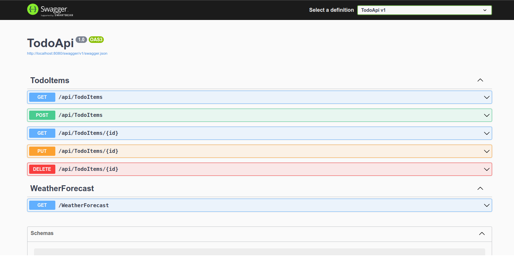

<h1 align="center">
  <br>
  
  <br>
  .NET API Template Using Controllers
  <br>
</h1>

<h4 align="center">A Web API to make available a template for future projects.</h4>

<p align="center">
  <a href="#how-to-use">How To Use</a> •
  <a href="#license">License</a>
</p>

<h1 align="center">
    
</h1>

## How To Use

To clone and run this application, you'll need [Git](https://git-scm.com) and [.NET](https://learn.microsoft.com/en-us/dotnet/core/install/) installed on your computer. From your command line:

```bash
# Clone this repository
$ git clone https://github.com/thalissoncastrog/dotnet-api-controllers.git

# Go into the repository
$ cd dotnet-api-controllers

# Install dependencies
$ dotnet restore

# Run the app
$ dotnet run
```

> **Note**
> After run each command above, go to a web browser and access this url: http://localhost:[port]/swagger.

<h4>- For a better experience, use Docker:</h4>

> **Note**:
> Install docker according your operating system [Docker Instalation](https://docs.docker.com/engine/install/).

```bash
# Clone this repository
$ git clone https://github.com/thalissoncastrog/dotnet-api-controllers.git

# Go into the repository
$ cd dotnet-api-controllers

# Do the next commands as root user
$ sudo su

# Create a docker image from Dockerfile
$ docker build -t api-controllers-dotnet:1.0.0 .

# Create a container from the image created before
$ docker run -d -p 8080:8080 api-controllers-dotnet:1.0.0
```

> **Note**
> After run each command above, go to a web browser and access this url: [http://localhost:8080/swagger](http://localhost:8080/swagger).

## License

MIT

---

> Instagram [@thalissoncastrog](https://www.instagram.com/thalissoncastrog/) &nbsp;&middot;&nbsp;
> GitHub [@thalissoncastrog](https://github.com/thalissoncastrog) &nbsp;&middot;&nbsp;
> Email [thalisson.adao@gmail.com](mailto:thalisson.adao@gmail.com)
